```mermaid
flowchart TB
    %% External Entity
    ADMIN["Admin"]
    
    %% Processes
    P1["1.0<br/>Authenticate<br/>Admin"]
    P2["2.0<br/>Manage<br/>Outlets"]
    P3["3.0<br/>Manage<br/>Workers"]
    P4["4.0<br/>Manage<br/>Managers"]
    P5["5.0<br/>Approve Worker<br/>Onboarding"]
    P6["6.0<br/>Monitor<br/>Attendance"]
    P7["7.0<br/>Process Worker<br/>Adjustments"]
    P8["8.0<br/>Generate<br/>Payroll"]
    P9["9.0<br/>Generate<br/>Reports & Analytics"]
    
    %% Data Stores
    DS1[("D1: auth.users<br/>(Supabase Auth)")]
    DS2[("D2: app_users")]
    DS3[("D3: outlets")]
    DS4[("D4: workers")]
    DS5[("D5: managers")]
    DS6[("D6: attendance_logs")]
    DS7[("D7: worker_adjustments")]
    DS8[("D8: payroll_records")]
    DS9[("D9: worker_onboarding_requests")]
    DS10[("D10: worker_daily_hours")]
    DS11[("D11: payroll_generation_audit")]
    
    %% Admin to Process 1 (Authentication)
    ADMIN -->|"Email, Password"| P1
    P1 -->|"Authentication Result,<br/>Role Verification"| ADMIN
    P1 <-->|"Verify Credentials"| DS1
    P1 <-->|"Fetch Profile (role=admin)"| DS2
    
    %% Admin to Process 2 (Manage Outlets)
    ADMIN -->|"Outlet Details<br/>(name, GPS, radius)"| P2
    P2 -->|"Outlet Created/Updated/Deleted"| ADMIN
    P2 <-->|"CRUD Operations"| DS3
    
    %% Admin to Process 3 (Manage Workers)
    ADMIN -->|"Worker Details<br/>(name, email, phone,<br/>outlet, salary rates)"| P3
    P3 -->|"Worker Created/Updated,<br/>Password Reset"| ADMIN
    P3 <-->|"Create Auth User"| DS1
    P3 <-->|"CRUD Operations"| DS4
    P3 -->|"Read Outlet Data"| DS3
    
    %% Admin to Process 4 (Manage Managers)
    ADMIN -->|"Manager Details<br/>(email, password,<br/>outlet assignment)"| P4
    P4 -->|"Manager Created/Updated,<br/>Password Reset"| ADMIN
    P4 <-->|"Create Auth User"| DS1
    P4 <-->|"Create/Update app_user"| DS2
    P4 <-->|"Create/Update Manager Record"| DS5
    P4 -->|"Read Outlet Data"| DS3
    
    %% Admin to Process 5 (Approve Onboarding)
    ADMIN -->|"Approval Decision<br/>(approve/reject)"| P5
    P5 -->|"Request Status,<br/>New Worker Created"| ADMIN
    P5 <-->|"Update Request Status"| DS9
    P5 -->|"Create Auth User<br/>(if approved)"| DS1
    P5 -->|"Create Worker<br/>(if approved)"| DS4
    
    %% Admin to Process 6 (Monitor Attendance)
    ADMIN -->|"Manual Attendance Entry<br/>(worker, outlet, IN/OUT)"| P6
    P6 -->|"Attendance Logs,<br/>Summary Statistics"| ADMIN
    P6 <-->|"CRUD Attendance"| DS6
    P6 -->|"Read Worker/Outlet Names"| DS4
    P6 -->|"Read Worker/Outlet Names"| DS3
    
    %% Admin to Process 7 (Worker Adjustments)
    ADMIN -->|"Adjustment Details<br/>(worker, type, amount/hours,<br/>effective date)"| P7
    P7 -->|"Adjustment Created"| ADMIN
    P7 <-->|"Create Adjustments"| DS7
    P7 -->|"Read Worker Data"| DS4
    
    %% Admin to Process 8 (Generate Payroll)
    ADMIN -->|"Payroll Month<br/>(YYYY-MM)"| P8
    P8 -->|"Payroll Run Results,<br/>Individual Payslip"| ADMIN
    P8 -->|"Read Worker Data"| DS4
    P8 -->|"Read Worked Hours"| DS10
    P8 <-->|"Read/Sum Adjustments"| DS7
    P8 <-->|"Create/Read Payroll Records"| DS8
    P8 -->|"Log Generation Audit"| DS11
    
    %% Admin to Process 9 (Reports)
    ADMIN -->|"Report Request<br/>(date range, filters)"| P9
    P9 -->|"Dashboard Analytics,<br/>Outlet Analytics,<br/>CSV Export"| ADMIN
    P9 -->|"Read Hours Data"| DS10
    P9 -->|"Read Adjustments"| DS7
    P9 -->|"Read Payroll Records"| DS8
    P9 -->|"Read Workers/Outlets"| DS4
    P9 -->|"Read Workers/Outlets"| DS3
```

```mermaid
flowchart TB
    %% External Entity
    MANAGER["Manager"]
    
    %% Processes
    P1["1.0<br/>Authenticate<br/>Manager"]
    P2["2.0<br/>View Assigned<br/>Outlet"]
    P3["3.0<br/>Monitor Worker<br/>Attendance"]
    P4["4.0<br/>Submit Worker<br/>Onboarding Request"]
    P5["5.0<br/>Log<br/>Attendance"]
    P6["6.0<br/>Review Fine<br/>Appeals"]
    P7["7.0<br/>Preview Outlet<br/>Payroll"]
    P8["8.0<br/>View<br/>Notifications"]
    P9["9.0<br/>View Worker<br/>Analytics"]
    
    %% Data Stores
    DS1[("D1: auth.users<br/>(Supabase Auth)")]
    DS2[("D2: app_users")]
    DS3[("D3: managers")]
    DS4[("D4: outlets")]
    DS5[("D5: workers")]
    DS6[("D6: attendance_logs")]
    DS7[("D7: worker_onboarding_requests")]
    DS8[("D8: fine_appeals")]
    DS9[("D9: worker_adjustments")]
    DS10[("D10: notifications")]
    DS11[("D11: worker_daily_hours")]
    DS12[("D12: payroll_records")]
    
    %% Manager to Process 1 (Authentication)
    MANAGER -->|"Email, Password"| P1
    P1 -->|"Authentication Result,<br/>Role Verification"| MANAGER
    P1 <-->|"Verify Credentials"| DS1
    P1 <-->|"Fetch Profile (role=manager)"| DS2
    P1 -->|"Read Manager Record"| DS3
    
    %% Manager to Process 2 (View Outlet)
    MANAGER -->|"View Outlet Request"| P2
    P2 -->|"Outlet Details<br/>(name, GPS, radius)"| MANAGER
    P2 -->|"Read Assigned Outlet"| DS3
    P2 -->|"Read Outlet Data"| DS4
    
    %% Manager to Process 3 (Monitor Attendance)
    MANAGER -->|"Filter Request<br/>(date, worker)"| P3
    P3 -->|"Attendance Logs<br/>(Outlet-Filtered)"| MANAGER
    P3 -->|"Read Attendance<br/>(outlet-filtered via RLS)"| DS6
    P3 -->|"Read Worker Names"| DS5
    
    %% Manager to Process 4 (Worker Request)
    MANAGER -->|"Worker Details<br/>(name, email, phone,<br/>salary rates)"| P4
    P4 -->|"Request Submitted,<br/>Request Status"| MANAGER
    P4 <-->|"Create/Read Requests<br/>(requested_by = manager)"| DS7
    P4 -->|"Read Outlet Assignment"| DS3
    
    %% Manager to Process 5 (Log Attendance)
    MANAGER -->|"Attendance Entry<br/>(worker, IN/OUT)"| P5
    P5 -->|"Attendance Logged"| MANAGER
    P5 <-->|"Create Attendance Record"| DS6
    P5 -->|"Read Workers<br/>(outlet-filtered)"| DS5
    P5 -->|"Read Outlet ID"| DS3
    
    %% Manager to Process 6 (Fine Appeals)
    MANAGER -->|"Appeal Response<br/>(approve/reject, comment)"| P6
    P6 -->|"Pending Appeals,<br/>Resolution Status"| MANAGER
    P6 <-->|"Read/Update Appeals<br/>(manager_id = self)"| DS8
    P6 <-->|"Update Adjustment<br/>(if approved)"| DS9
    P6 -->|"Read Worker Names"| DS5
    
    %% Manager to Process 7 (Preview Payroll)
    MANAGER -->|"Payroll Month<br/>(YYYY-MM)"| P7
    P7 -->|"Payroll Preview<br/>(Outlet Workers Only)"| MANAGER
    P7 -->|"Read Workers<br/>(outlet-filtered)"| DS5
    P7 -->|"Read Worked Hours"| DS11
    P7 -->|"Read Adjustments"| DS9
    P7 -->|"Read Existing Payroll"| DS12
    
    %% Manager to Process 8 (Notifications)
    MANAGER -->|"Mark as Read Request"| P8
    P8 -->|"Notification List"| MANAGER
    P8 <-->|"Read/Update Notifications<br/>(user_id = manager)"| DS10
    
    %% Manager to Process 9 (Analytics)
    MANAGER -->|"Analytics Request<br/>(date range)"| P9
    P9 -->|"Worker Hours Analytics"| MANAGER
    P9 -->|"Read Workers<br/>(outlet-filtered)"| DS5
    P9 -->|"RPC: get_worker_analytics"| DS11
    P9 -->|"Read Adjustments"| DS9
```

# WorkForge – Academic Diagrams
## MCA Main Project Documentation

**Project Title:** WorkForge – Worker Attendance and Payroll Management System  
**Course:** MCA  
**Focus Area:** Web Application Module (Admin and Manager Roles)

---

## Table of Contents
1. [Use Case Diagram](#1-use-case-diagram)
2. [DFD Level 0 - Context Diagram](#2-dfd-level-0---context-diagram)
3. [DFD Level 1 - Admin Module](#3-dfd-level-1---admin-module)
4. [DFD Level 1 - Manager Module](#4-dfd-level-1---manager-module)

---

## 1. Use Case Diagram

### System: WorkForge Web Application

**Actors:**
- Admin
- Manager  
- Supabase Backend (External System)

```mermaid
graph TB
    subgraph "WorkForge Web Application"
        %% Admin Use Cases
        UC1["Login"]
        UC2["Manage Outlets"]
        UC3["Manage Workers"]
        UC4["Manage Managers"]
        UC5["Approve Worker Onboarding"]
        UC6["Monitor Attendance"]
        UC7["Log Attendance Manually"]
        UC8["Add Worker Adjustments"]
        UC9["Generate Payroll"]
        UC10["Preview Payroll"]
        UC11["View Worker Payslip"]
        UC12["Export Payroll Stats"]
        UC13["View Dashboard & Analytics"]
        UC14["Reset User Passwords"]
        UC15["Logout"]
        
        %% Manager Use Cases
        UC16["View Assigned Outlet"]
        UC17["Submit Worker Onboarding Request"]
        UC18["View Request Status"]
        UC19["Monitor Worker Attendance"]
        UC20["Log Attendance for Workers"]
        UC21["Review Fine Appeals"]
        UC22["Respond to Fine Appeals"]
        UC23["Preview Outlet Payroll"]
        UC24["View Notifications"]
        UC25["View Worker Analytics"]
    end
    
    %% External System
    SUPABASE["Supabase Backend"]
    
    %% Actors
    ADMIN["Admin"]
    MANAGER["Manager"]
    
    %% Admin Relationships
    ADMIN -->|performs| UC1
    ADMIN -->|performs| UC2
    ADMIN -->|performs| UC3
    ADMIN -->|performs| UC4
    ADMIN -->|performs| UC5
    ADMIN -->|performs| UC6
    ADMIN -->|performs| UC7
    ADMIN -->|performs| UC8
    ADMIN -->|performs| UC9
    ADMIN -->|performs| UC10
    ADMIN -->|performs| UC11
    ADMIN -->|performs| UC12
    ADMIN -->|performs| UC13
    ADMIN -->|performs| UC14
    ADMIN -->|performs| UC15
    
    %% Manager Relationships
    MANAGER -->|performs| UC1
    MANAGER -->|performs| UC16
    MANAGER -->|performs| UC17
    MANAGER -->|performs| UC18
    MANAGER -->|performs| UC19
    MANAGER -->|performs| UC20
    MANAGER -->|performs| UC21
    MANAGER -->|performs| UC22
    MANAGER -->|performs| UC23
    MANAGER -->|performs| UC24
    MANAGER -->|performs| UC25
    MANAGER -->|performs| UC15
    
    %% Backend Relationships
    UC1 -.->|uses| SUPABASE
    UC2 -.->|uses| SUPABASE
    UC3 -.->|uses| SUPABASE
    UC4 -.->|uses| SUPABASE
    UC5 -.->|uses| SUPABASE
    UC6 -.->|uses| SUPABASE
    UC7 -.->|uses| SUPABASE
    UC8 -.->|uses| SUPABASE
    UC9 -.->|uses| SUPABASE
    UC10 -.->|uses| SUPABASE
    UC11 -.->|uses| SUPABASE
    UC12 -.->|uses| SUPABASE
    UC13 -.->|uses| SUPABASE
    UC14 -.->|uses| SUPABASE
    UC16 -.->|uses| SUPABASE
    UC17 -.->|uses| SUPABASE
    UC18 -.->|uses| SUPABASE
    UC19 -.->|uses| SUPABASE
    UC20 -.->|uses| SUPABASE
    UC21 -.->|uses| SUPABASE
    UC22 -.->|uses| SUPABASE
    UC23 -.->|uses| SUPABASE
    UC24 -.->|uses| SUPABASE
    UC25 -.->|uses| SUPABASE
```



### Use Case Descriptions

#### Admin Use Cases:
1. **Login** - Authenticate using email and password
2. **Manage Outlets** - Create, update, delete outlets with GPS coordinates
3. **Manage Workers** - Create workers with salary details, update worker information
4. **Manage Managers** - Create managers, assign to outlets, activate/deactivate
5. **Approve Worker Onboarding** - Review and approve/reject manager requests
6. **Monitor Attendance** - View all attendance logs across all outlets
7. **Log Attendance Manually** - Add IN/OUT records for workers
8. **Add Worker Adjustments** - Add overtime, incentives, fines, deductions
9. **Generate Payroll** - Calculate and save payroll for all workers for a month
10. **Preview Payroll** - Preview payroll calculations without saving
11. **View Worker Payslip** - View detailed payslip for a specific worker
12. **Export Payroll Stats** - Export worker statistics to CSV
13. **View Dashboard & Analytics** - View outlet analytics, hours summary, trends
14. **Reset User Passwords** - Reset passwords for workers and managers
15. **Logout** - End session

#### Manager Use Cases:
1. **Login** - Authenticate using email and password
2. **View Assigned Outlet** - View details of assigned outlet
3. **Submit Worker Onboarding Request** - Request admin to create new workers
4. **View Request Status** - Track approval status of worker requests
5. **Monitor Worker Attendance** - View attendance logs for outlet workers
6. **Log Attendance for Workers** - Manually log IN/OUT for outlet workers
7. **Review Fine Appeals** - View pending fine appeals from workers
8. **Respond to Fine Appeals** - Approve or reject fine appeals with comments
9. **Preview Outlet Payroll** - View payroll preview for outlet workers only
10. **View Notifications** - Receive and read system notifications
11. **View Worker Analytics** - View worker performance analytics
12. **Logout** - End session

#### Supabase Backend Responsibilities:
- Authenticate users via auth.users
- Store and retrieve data (outlets, workers, attendance, payroll)
- Enforce Row Level Security (RLS) policies
- Execute stored procedures for analytics
- Provide real-time data updates

---

## 2. DFD Level 0 - Context Diagram

### System: WorkForge Web Application



```mermaid
flowchart TB
    %% External Entities
    ADMIN["Admin"]
    MANAGER["Manager"]
    SUPABASE["Supabase Backend"]
    
    %% System
    SYSTEM["WorkForge Web Application"]
    
    %% Admin Data Flows
    ADMIN -->|"Login Credentials"| SYSTEM
    ADMIN -->|"Outlet Data (Create/Update/Delete)"| SYSTEM
    ADMIN -->|"Worker Data (Create/Update)"| SYSTEM
    ADMIN -->|"Manager Data (Create/Update/Assign)"| SYSTEM
    ADMIN -->|"Approval Decisions (Approve/Reject Requests)"| SYSTEM
    ADMIN -->|"Attendance Logs (Manual Entry)"| SYSTEM
    ADMIN -->|"Worker Adjustments (OT/Incentive/Fine)"| SYSTEM
    ADMIN -->|"Payroll Generation Request"| SYSTEM
    ADMIN -->|"Password Reset Requests"| SYSTEM
    
    SYSTEM -->|"Dashboard Summary"| ADMIN
    SYSTEM -->|"Attendance Reports"| ADMIN
    SYSTEM -->|"Payroll Data & Slips"| ADMIN
    SYSTEM -->|"Outlet Analytics"| ADMIN
    SYSTEM -->|"Worker Statistics (CSV Export)"| ADMIN
    SYSTEM -->|"Worker Onboarding Requests"| ADMIN
    
    %% Manager Data Flows
    MANAGER -->|"Login Credentials"| SYSTEM
    MANAGER -->|"Worker Onboarding Requests"| SYSTEM
    MANAGER -->|"Attendance Logs (Manual Entry)"| SYSTEM
    MANAGER -->|"Fine Appeal Responses"| SYSTEM
    
    SYSTEM -->|"Outlet Details"| MANAGER
    SYSTEM -->|"Attendance Data (Outlet-Specific)"| MANAGER
    SYSTEM -->|"Worker List (Outlet-Specific)"| MANAGER
    SYSTEM -->|"Payroll Preview (Read-Only)"| MANAGER
    SYSTEM -->|"Notifications"| MANAGER
    SYSTEM -->|"Fine Appeals (Pending)"| MANAGER
    SYSTEM -->|"Request Status Updates"| MANAGER
    SYSTEM -->|"Worker Analytics"| MANAGER
    
    %% System to Supabase
    SYSTEM <-->|"Authentication Requests/Responses"| SUPABASE
    SYSTEM <-->|"User Profile Data (app_users)"| SUPABASE
    SYSTEM <-->|"Outlet Data (outlets)"| SUPABASE
    SYSTEM <-->|"Worker Data (workers)"| SUPABASE
    SYSTEM <-->|"Manager Data (managers)"| SUPABASE
    SYSTEM <-->|"Attendance Logs (attendance_logs)"| SUPABASE
    SYSTEM <-->|"Worker Adjustments (worker_adjustments)"| SUPABASE
    SYSTEM <-->|"Payroll Records (payroll_records)"| SUPABASE
    SYSTEM <-->|"Worker Requests (worker_onboarding_requests)"| SUPABASE
    SYSTEM <-->|"Notifications (notifications)"| SUPABASE
    SYSTEM <-->|"Fine Appeals (fine_appeals)"| SUPABASE
    SYSTEM <-->|"Analytics RPC Calls (get_worker_analytics)"| SUPABASE
    SYSTEM <-->|"Real-Time Change Notifications"| SUPABASE
```

### Data Flow Summary

| Source | Destination | Data Description |
|--------|-------------|------------------|
| Admin → System | Login Credentials, Management Requests | Authentication, CRUD operations for outlets/workers/managers |
| System → Admin | Dashboard, Reports, Analytics | Business intelligence, payroll data, attendance reports |
| Manager → System | Login Credentials, Requests | Authentication, worker onboarding, attendance logging |
| System → Manager | Outlet Data, Notifications | Outlet-specific information, alerts, analytics |
| System ↔ Supabase | All Application Data | Authentication, data persistence, RLS enforcement, real-time updates |

---

## 3. DFD Level 1 - Admin Module

### Processes and Data Flows



### Process Descriptions

| Process | Description | Input | Output |
|---------|-------------|-------|--------|
| 1.0 Authenticate Admin | Verify admin credentials and role | Email, Password | Auth token, Admin profile |
| 2.0 Manage Outlets | Create, update, delete outlet locations | Outlet details (name, GPS, radius) | Outlet records |
| 3.0 Manage Workers | Create workers with auth, update details, reset passwords | Worker details, salary rates | Worker records, auth accounts |
| 4.0 Manage Managers | Create managers, assign outlets, manage access | Manager details, outlet assignment | Manager records, auth accounts |
| 5.0 Approve Worker Onboarding | Review and approve/reject manager requests | Request ID, decision, comment | Updated request status, new worker |
| 6.0 Monitor Attendance | View all attendance, manually log entries | Worker ID, outlet ID, action | Attendance records |
| 7.0 Process Worker Adjustments | Add OT, incentives, fines, deductions | Worker ID, type, amount/hours | Adjustment records |
| 8.0 Generate Payroll | Calculate payroll for month, preview or save | Payroll month (YYYY-MM) | Payroll records, payslips |
| 9.0 Generate Reports & Analytics | Dashboard stats, outlet analytics, CSV export | Date range, filters | Analytics data, CSV file |

---

## 4. DFD Level 1 - Manager Module

### Processes and Data Flows



### Process Descriptions

| Process | Description | Input | Output | RLS Applied |
|---------|-------------|-------|--------|-------------|
| 1.0 Authenticate Manager | Verify manager credentials and role | Email, Password | Auth token, Manager profile | - |
| 2.0 View Assigned Outlet | Retrieve outlet details for assigned outlet | Manager ID | Outlet details | Yes (outlet_id from managers table) |
| 3.0 Monitor Worker Attendance | View attendance logs for outlet workers only | Date filter, worker filter | Attendance records | Yes (outlet-level filtering) |
| 4.0 Submit Worker Onboarding Request | Request admin to create new worker | Worker details, salary | Request record, status | Yes (can only create own requests) |
| 5.0 Log Attendance | Manually log IN/OUT for outlet workers | Worker ID, action (IN/OUT) | Attendance record | Yes (can only log for own outlet) |
| 6.0 Review Fine Appeals | View and respond to fine appeals from workers | Appeal ID, decision, comment | Appeal status update | Yes (manager_id = self) |
| 7.0 Preview Outlet Payroll | Preview payroll for outlet workers (read-only) | Payroll month (YYYY-MM) | Payroll preview data | Yes (outlet-level filtering) |
| 8.0 View Notifications | View and mark notifications as read | Notification ID | Notification list | Yes (user_id = manager) |
| 9.0 View Worker Analytics | View performance analytics for outlet workers | Date range | Worker hours, OT analytics | Yes (outlet-level filtering) |

---

## Key Implementation Notes

### Row Level Security (RLS)
The system enforces strict data access control:

- **Admin**: Full access to all tables and records
- **Manager**: 
  - Can only view/edit workers assigned to their outlet
  - Can only view attendance logs for their outlet
  - Can only create worker requests for their outlet
  - Can only view/respond to fine appeals assigned to them
  - Payroll preview is read-only and outlet-filtered

### Authentication Flow
1. User enters email/password on login page
2. Supabase Auth verifies credentials
3. System fetches `app_users` record using `auth_id`
4. Role-based redirect:
   - `role='admin'` → Admin Dashboard
   - `role='manager'` → Manager Dashboard
   - `role='worker'` → Worker Dashboard (mobile)
5. Middleware enforces authentication on all protected routes

### Payroll Calculation Logic
**Formula implemented in `generatePayrollForMonthAction` and `previewPayrollForMonthAction`:**

```
Base Salary = Worked Hours × Base Salary Per Hour
Overtime = Sum of OT Adjustments (from worker_adjustments)
Incentives = Sum of Incentive Adjustments
Fines = Sum of Fine Adjustments
Calculated Total = Base Salary + Overtime + Incentives - Fines
```

**Data Sources:**
- Worked Hours: `worker_daily_hours` view (aggregates attendance_logs)
- Adjustments: `worker_adjustments` table (filtered by effective_date)
- Worker Rates: `workers.base_salary_per_hour`, `workers.ot_rate_per_hour`

### Real-Time Features
- Notifications are stored in `notifications` table
- Fine appeals trigger notifications to managers
- Worker request status changes notify requesters
- Dashboard data refreshes on page reload (server-side rendering)

---

## Database Tables Used (Reference)

| Table | Primary Use | Admin Access | Manager Access |
|-------|-------------|--------------|----------------|
| auth.users | Authentication | Full | Read Own |
| app_users | User profiles | Full | Read Own |
| outlets | Outlet locations | Full CRUD | Read Assigned |
| workers | Worker records | Full CRUD | Read Outlet Workers |
| managers | Manager-outlet mapping | Full CRUD | Read Own |
| attendance_logs | Check-in/out records | Full | Outlet-Filtered |
| worker_adjustments | OT/Fine/Incentive | Full CRUD | Read Outlet Workers |
| payroll_records | Generated payroll | Full CRUD | Read-Only (Outlet) |
| worker_onboarding_requests | Worker requests | Full (Approve/Reject) | Own Requests Only |
| fine_appeals | Fine appeals | Read All | Assigned Appeals Only |
| notifications | System notifications | - | Own Notifications |
| worker_daily_hours | Calculated hours view | Read All | Read Outlet Workers |
| payroll_generation_audit | Payroll audit trail | Full | - |

---

## Diagram Legend

### Symbols Used

**Use Case Diagram:**
- Rectangle: System boundary
- Oval: Use case
- Stick figure: Actor
- Solid arrow: Association
- Dashed arrow: Dependency

**DFD:**
- Rectangle: Process (numbered)
- Cylinder: Data store
- Arrow: Data flow
- Rectangle (thick border): External entity

---

## Notes for Exam Preparation

1. **Use Case Diagram**: Focus on actor-system interactions, clearly distinguish admin vs manager capabilities
2. **DFD Level 0**: Shows system as black box, emphasizes data exchange with external entities
3. **DFD Level 1**: Decomposes system into major processes, shows data stores
4. **Process Numbering**: Hierarchical (1.0, 2.0, etc. for Level 1)
5. **Data Store Naming**: D1, D2, etc. corresponds to actual database tables
6. **RLS Enforcement**: Critical security feature - managers cannot access other outlets' data

---

**End of Academic Diagrams Document**
